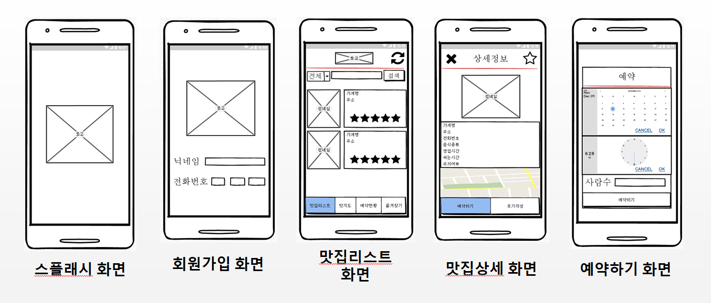
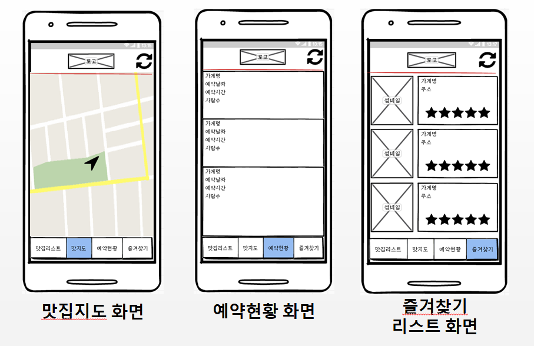
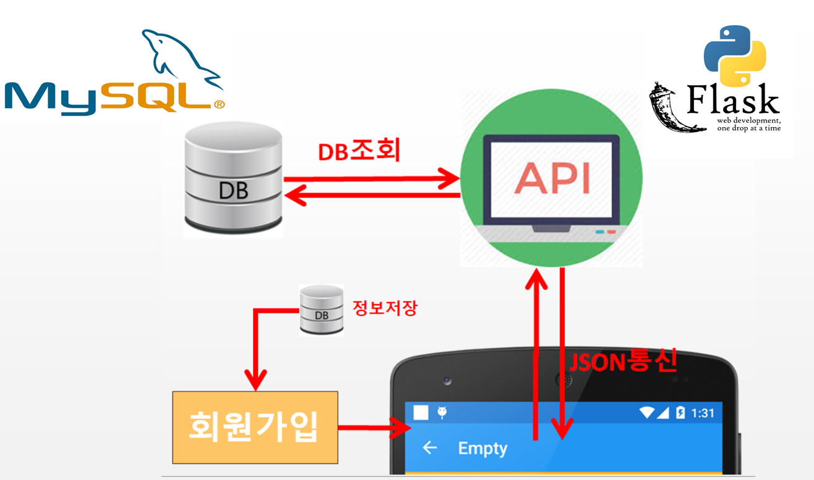

# 개요 (Overview)

- 해당 프로젝트는 맛집리뷰 어플(Only Android) 입니다.  

- [api 서버](https://github.com/yy8305/pook-android-api_server-python_flask)는 따로 만들어서 제작하였습니다.

- 제작기간 : 2주 ~ 3주 (거의 주말에만..)

- 사용기술 : Retrofit2, Picasso, Google Map api

# 어플 주요기능

- 회원가입 : 닉네임, 전화번호로 가입가능

- 맛집정보 : 맛집정보를 확인할수 있으며 검색을 통해 원하는 맛집 확인 가능

- 맛집지도 : 구글 지도 api를 통해 맛집들의 위치 확인 가능

- 즐겨찾기 : 즐겨찾기를 통해 맛집들을 저장하여 확인 가능

- 예약하기 : 맛집들을 원하는 시간에 예약가능

- 후기등록 기능 : 맛집들을 평점을 작성할수 있으며 평점순으로 맛집 확인가능

# 어플 설계서

# 실행화면
|어플 실행시 로고 표시(스플래쉬 화면)|회원가입 화면|
:-------------------------:|:-------------------------:
|||
|맛집리스트 화면|카테고리를 통해 검색 했을 경우|
|||
|가게명으로 검색했을 경우|예약하기 화면에서 입력|
|||
|예약되었을 경우 메시지 표시|예약 되었을 경우 예약현황 확인|
|||
|후기 입력 화면|후기 작성시 메시지 표시|
|||
|후기 작성후 상세정보에서 후기표시 확인|즐겨찾기 추가했을 경우 메시지 표시|
|||
|즐겨찾기 추가되었을 경우 즐겨찾기 화면|지도에서 현재 위치 표시|
|||
|지도에서 마커 클릭시 가게명 표시||
|||

# 어플 흐름도

